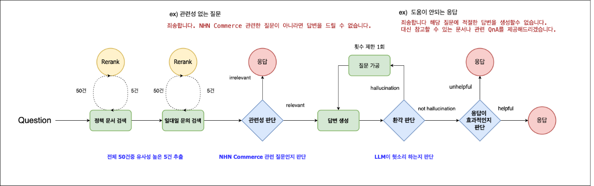
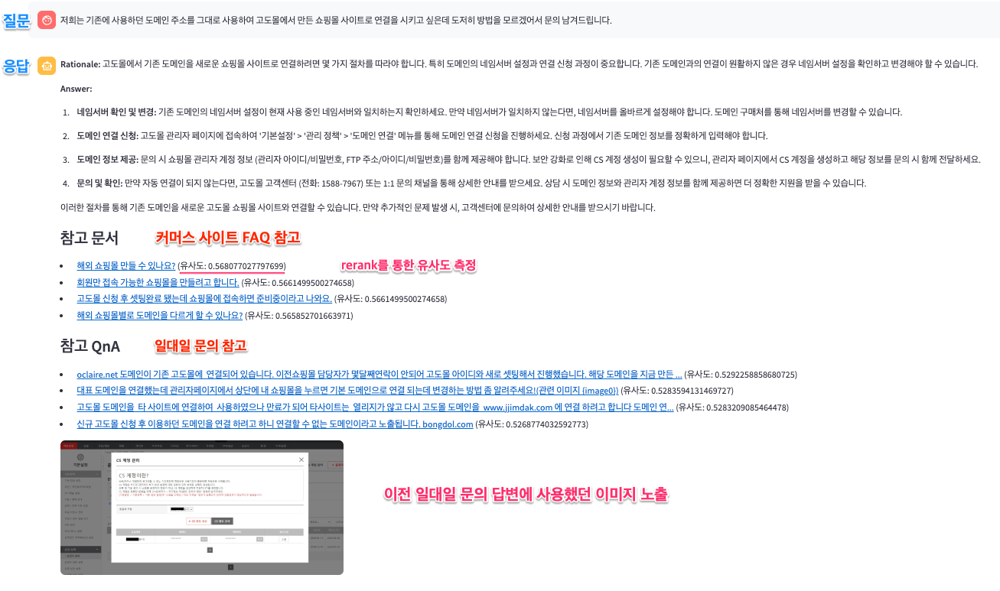

# 시연 순서

1. OCR
   1. 이미지에서 텍스트 추출
   2. 텍스트 위치 정보 추출
2. 이미지 인페인팅
   1. AI 지우개
   2. AI 영역 선택
3. 이미지 배경제거
4. 가상 피팅 : https://app.klingai.com/global/try-on/try-on/new
   1. 실제모델 + 가상 피팅
      1. 모델 : https://www.moomooz.co.kr/products/129200837
      2. 옷 : https://www.firstkid.co.kr/html/product/view.html?productNo=128615519
   2. 가상모델 생성 + 가상 피팅
      1. 옷 : https://www.emotioncastle.com/products/124395229
   3. 영상 : 생성 시간이 매우 김(20분 이상), 고비용
      1. kling ai : https://app.klingai.com/global/image-to-video/frame-mode/new
5. AI 상품 등록
   1. 이미지 특징을 분석하여 상품 정보 추출
   2. 옵션 등록 프롬프트를 이용하여 옵션 생성
   3. 고도몰 API를 이용하여 상품 등록
   4. 상품상세 생성
   5. 프롬프트를 입력받아 항목을 확장 할 수 있음
      1. 브랜드명은 나이키로 해줘.
      2. 상품 노출은 5월 10일 14시
      3. 디테일한 프롬프트 예시가 필요함
   6. 추가로 해볼만한 것들
      1. 쿠폰 등록 : 식품 카테고리 대상으로 일 한도 50만원 장바구니 쿠폰을 등록해줘. 사용기간은 5월 10일 14시 부터 시작이야
      2. [전체 주문 조회](https://service.shopby.co.kr/order/list?mallNos=2705,63655,63911,72941,72943,72945,74991&searchDateType=ORDER_YMDT&startYmd=2025-04-21&endYmd=2025-04-28&searchType=ALL&page=1&includeReservation=true&platformTypes=,PC,MOBILE_WEB,MOBILE_APP&partnerNo=0&taskMessageSearchType=ALL&includeHoldDelivery=true&orderStatusTypes=DEPOSIT_WAIT,PAY_DONE,PRODUCT_PREPARE,DELIVERY_PREPARE,DELIVERY_ING,DELIVERY_DONE,BUY_CONFIRM,CANCEL_DONE,EXCHANGE_DONE,RETURN_DONE&size=30&tabSort=deliveryResult&showDetail=false)
         1. 파트너가 A인 주문건 고객에게 "입점 파트너사에 큰 문제가 발생하여 배송이 불가능합니다."라고 문자 보내줘
         2. 상품번호 123353678 주문 상태를 구매확정 처리해줘
         3. 반품완료 고객에게 50% 쿠폰 발송해줘
6. 쇼핑몰 AI 분석
   1. 판매통계 분석
   2. gemini 2.0 flash의 경우 multi model(이미지, 텍스트등) 을 지원함 -> 시각적인 막대그래프, 꺽은선등 지원
   3. 쇼핑몰의 니즈에 따라 프롬프트를 변경하여 몰에서 원하는 보고서 양식 생성 가능
   4. 좀 더 기능을 확장한다면? (데이터 플랫폼에 정제된 쇼핑몰 데이터가 있을 경우)
      1. 어제 가장 많이 팔린 상품은?
      2. 한달간 반품이 가장 많았던 상품은?
7. AI 리뷰 요약(키워드)
   1. LLM을 이용한 키워드 요약
   2. 요약된 키워드와 원본 리뷰 text 매칭
   3. [참고1](https://andar.co.kr/product/detail.html?product_no=12168&cate_no=2017&display_group=1) [참고2](https://brand.naver.com/sonystore/products/6752601021?NaPm=ct%3Dma0pkbkw%7Cci%3Dcdd2e3238e5d1b89848d68ed7feb1ca9dafa83a6%7Ctr%3Dbrcbb%7Csn%3D3906329%7Chk%3Dd2d6024d5f0d76d28ecfa2d07ca7e37b7a52b6ca&nl-query=%ED%97%A4%EB%93%9C%ED%8F%B0#REVIEW)
   4. 키워드 추출을 ai 요약이 아닌 쇼핑몰에서 직접 입력하여 추출도 가능한 시나리오
8. 상품 문의 AI 문의 대응
   1. [샘플](https://thirtymall.com/detail?id=124157932)
   2. [어드민](https://service.shopby.co.kr/product/inquiry/list?mallNo=0&startYmd=2024-04-28&endYmd=2025-04-28&searchType=ALL&searchDateType=REGISTER_YMDT&replyStatusType=ALL&page=1&size=30&activeTab=list)
      1. AI아이콘 클릭 -> 자동 답변
      2. 상품 문의 발생시 이벤트 발행 -> AI 자동 답변 -> 어드민 웹푸시 or 모바일 어드민 앱푸시 -> 자동답변 승인
   3. 몰별, 상품별 답변 템플릿화
9. 전화상담 TTS, 일대일문의\_감정평가
   1. 전화상담 mp3 텍스트 추출 & 요약, AI 평가
   2. COS 1:1 문의 감정 평가
10. 일대일문의 LLM 챗봇(RAG구축)

- Vector DB: Quadrant
- LangGraph 구조
  
- Streamlit
  
